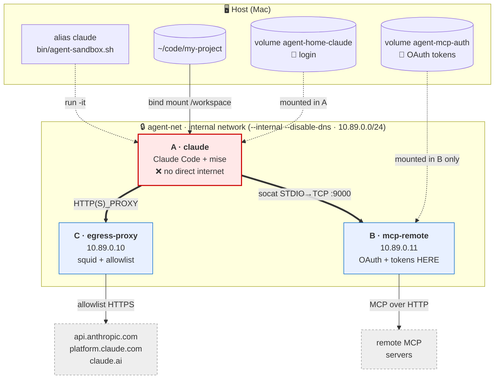
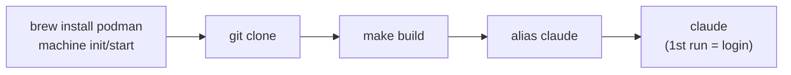

# agent-airlock

Run **Claude Code** in autonomous mode (`--dangerously-skip-permissions`) inside a
**Podman** sandbox, without exposing the host to secret exfiltration or data destruction.

> 📐 Threat model + architecture decisions: [`docs/architecture.md`](docs/architecture.md)
> 📚 Guides & technical docs: [`docs/`](docs/README.md) · [`CONTRIBUTING.md`](CONTRIBUTING.md)

## Table of Contents
- [Why](#why)
- [Architecture](#architecture)
- [Repo Structure](#repo-structure)
- [Prerequisites](#prerequisites)
- [Installation](#installation)
- [Verify the Setup](#verify-the-setup)
- [Going Further](#going-further)
- [TODO / Known Limitations](#todo--known-limitations)

---

## Why

Two working assumptions (detailed in the [architecture doc](docs/architecture.md)):

1. **Lethal trifecta** (Simon Willison): an agent combining *private data* +
   *untrusted content* (issues, web pages, unreviewed code) + *an output channel* can be
   hijacked via prompt injection to exfiltrate data.
2. **Agent Murphy's Law**: assume the agent will eventually cause all damage it is
   *capable* of causing (injection **or** simple mistake).

Consequence: don't trust the agent — lock it in a box where it can neither exfiltrate
secrets nor destroy data. **Source code is not considered sensitive data** (versioned by
git) → it is simply bind-mounted as a volume.

---

## Architecture

Three containers, an **internal network with no internet route** (`agent-net`). Only
sidecars B and C have a second network interface to the internet; the Claude container
has **none**.



| # | Container | Role | Internet | Secrets |
|---|-----------|------|----------|---------|
| **A** | `claude` | Claude Code + mise. Code is mounted here. | ❌ direct — **only** via proxy C | none |
| **B** | `mcp-remote` / `mcp-proxy` | MCP proxy with Bearer injection (pre-imported tokens) | ✅ (MCP servers) | **MCP tokens** (sidecar only) |
| **C** | `egress-proxy` | Squid proxy, egress allowlist | ✅ (allowlist) | — |

Core idea: **credentials never live in the container running the agent.**
The harness sees a "local" MCP (streamable-http to the sidecar proxy).
OAuth is handled automatically by the proxy (PKCE + callback) — the user simply
opens the URL displayed in `podman logs`.

> Wiring details → [`docs/network.md`](docs/network.md) · secrets & login →
> [`docs/authentication.md`](docs/authentication.md) · web access →
> [`docs/web-access.md`](docs/web-access.md).

---

## Repo Structure

```
agent-airlock/
├── bin/
│   ├── agent-sandbox.sh          # generic launcher: profile → build if missing → network → sidecars → run
│   ├── agent-doctor.sh           # full diagnostics (infra + isolation + auth)
│   ├── agent-import-auth.sh      # imports host-side login (auth.json) → volume (selective)
│   ├── agent-import-config.sh    # seeds host config (settings/agents/skills…) → volume (opt-in)
│   └── agent-mcp-wire.sh         # wires host mcp.json MCP servers onto the sidecar
├── lib/
│   └── profiles.sh               # profile helpers (list/load/select/resolve/ensure-image)
├── profiles/
│   ├── claude/                   # harness profile (oauth) — see docs/profiles.md
│   │   ├── profile.env             # harness variables (bin, config-dir, volume, auth…)
│   │   ├── install.sh              # installs the harness binary in the image
│   │   ├── allowlist.conf          # allowed egress domains (profile egress allowlist)
│   │   └── config/mcp.json         # seeded config bundle (MCP, skills, commands, plugins)
│   ├── pi/                       # pi harness profile (apikey) — provider-agnostic
│   └── opencode/                 # opencode harness profile (apikey)
├── providers/                    # provider catalog (key + egress domain, coupled)
│   ├── anthropic.env  openai.env  google.env  deepseek.env
│   └── openrouter.env groq.env    mistral.env xai.env
├── containers/
│   ├── base/
│   │   ├── Containerfile           # base image: node + mise + socat + git + agent user
│   │   ├── entrypoint.sh           # generic: seed config · mise install · hooks · launch $HARNESS_BIN
│   │   └── git-hooks-template/     # neutral hooks (anti-escape)
│   ├── harness/
│   │   └── Containerfile           # base + install.sh + config bundle (context = profiles/<name>)
│   └── mcp-remote/
│       ├── Containerfile           # MCP sidecar image: Node.js proxy (Bearer token injection)
│       ├── entrypoint.sh           # 1 node proxy.js per server declared in servers.d/*.env
│       ├── proxy.js                # minimal HTTP proxy (~90 lines)
│       ├── servers.d/
│       │   └── example.env.sample # MCP server template (NAME/URL/PORT)
│       └── servers.d-proxy/       # (generated by agent-mcp-wire.sh, gitignored)
├── egress/
│   └── squid.base.conf             # shared proxy base (ports + deny); allowlist comes from profile
├── Makefile                        # image build/push
└── docs/                           # architecture + guides (see docs/README.md)
```

Central settings (registry, IPs, ports, volumes): header of `bin/agent-sandbox.sh`.

---

## Prerequisites

- **macOS** (Apple Silicon tested) — the principle also works on Linux, without a VM.
- **Homebrew**
- **Podman** (VM managed by `podman machine`)

---

## Installation



```sh
# 1. Podman + VM (native Apple provider, no external dependencies)
brew install podman
podman machine init --provider applehv
podman machine start

# 2. Clone the repo
git clone <this-repo> ~/agent-airlock
cd ~/agent-airlock

# 3. Build images (until there's a team registry)
make build          # base + claude harness + sidecars; or let the launcher build on the fly

# 4. Alias in your shell rc (~/.zshrc)
alias claude='~/agent-airlock/bin/agent-sandbox.sh --profile claude'
alias agent-doctor='~/agent-airlock/bin/agent-doctor.sh'
# Multi-harness variant: set a default without hardcoding an alias
#   export AGENT_PROFILE=claude        # "always this harness"
#   alias agent='~/agent-airlock/bin/agent-sandbox.sh'   # --profile X overrides; --choose forces the menu

# 5. First run (in a repo UNDER $HOME, not /tmp)
cd ~/code/my-project
claude          # → subscription login on 1st run ("paste the code" flow)
```

> 🧑‍🤝‍🧑 Installing on a teammate's machine: dedicated guide
> [`docs/onboarding.md`](docs/onboarding.md).

---

## Verify the Setup

```sh
agent-doctor          # or: ~/agent-airlock/bin/agent-doctor.sh
```

One-shot check (16 checks): podman machine, **VM clock** (drift → OAuth logout), images,
network `internal=true dns=false`, sidecars, **direct internet blocked**, **egress allowlist**
(anthropic/claude.ai/platform allowed, rest denied), MCP tunnel, and **login persistence**.

From a running Claude session: `/status` (account, model), `/mcp` (MCP servers),
`/doctor` (internal health).

---

## Going Further

| Doc | Content |
|---|---|
| [`docs/architecture.md`](docs/architecture.md) | Threat model, design decisions |
| [`docs/profiles.md`](docs/profiles.md) | Multi-harness: profiles, resolution, adding a harness (pi, opencode…) |
| [`docs/network.md`](docs/network.md) | Internal network, DNS, static IPs, MCP socat tunnel |
| [`docs/web-access.md`](docs/web-access.md) | WebSearch / WebFetch / MCP: what Claude can fetch |
| [`docs/authentication.md`](docs/authentication.md) | Subscription login, clock resync, volumes |
| [`docs/add-mcp.md`](docs/add-mcp.md) | Connecting an MCP server |
| [`docs/add-skill.md`](docs/add-skill.md) | Adding a shared skill |
| [`docs/add-command.md`](docs/add-command.md) | Slash-commands & plugins |
| [`docs/egress-allowlist.md`](docs/egress-allowlist.md) | Authorizing an egress domain |
| [`docs/build-and-images.md`](docs/build-and-images.md) | Build, images, team registry |
| [`docs/onboarding.md`](docs/onboarding.md) | Installing on a new machine |
| [`docs/troubleshooting.md`](docs/troubleshooting.md) | Troubleshooting |
| [`CONTRIBUTING.md`](CONTRIBUTING.md) | Workflow, conventions, PR checklist |

---

## TODO / Known Limitations

- **Team registry**: push the shared image (`make push`) to avoid local `make build`
  for every teammate and distribute updated skills/plugins automatically.
- **Claude-side MCP registration**: `mcp.json` is embedded but not yet registered in the
  right location (`claude mcp add --scope user` at entrypoint) + a real server in
  `servers.d/`.
- **`mise install` × egress**: add registries (npm, mise, github) to the allowlist if
  installing tools at runtime.
- **MCP audit trail**: aim for a centralized MCP gateway (incident response).
- **Shared skills/plugins**: directories to populate in the image (`/opt/dist`).
- **Non-engineer users**: the flow (podman, clone, build) remains too technical.

---

## License

[MIT](LICENSE) — © 2026 Axel Leclercq. Do what you want with it, keep the copyright notice,
no warranty.
