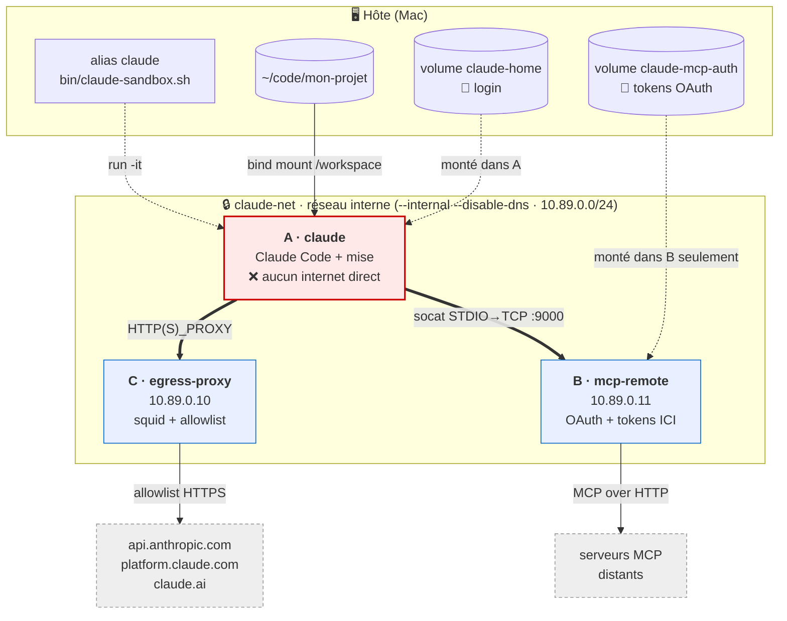
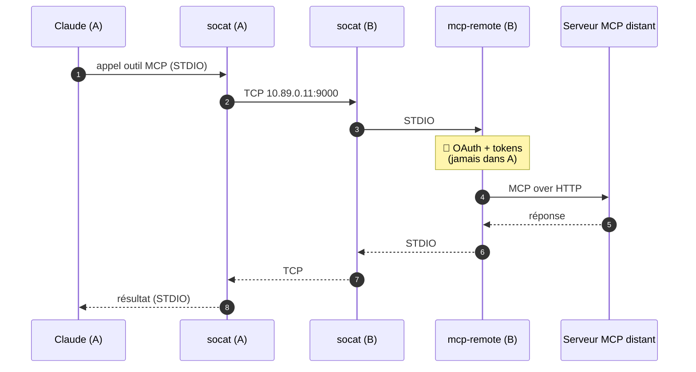
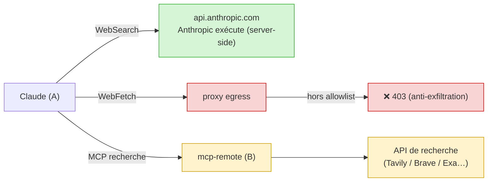
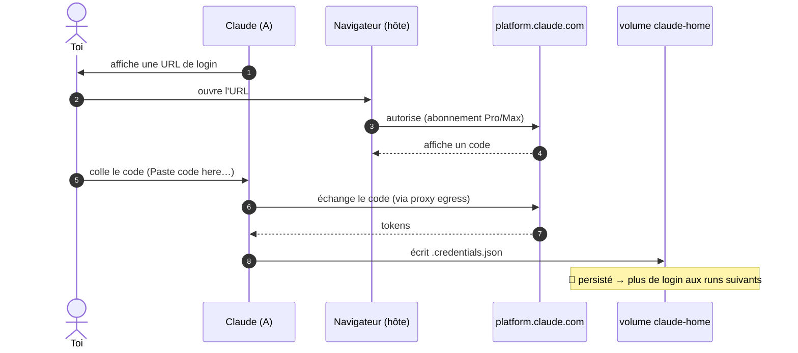
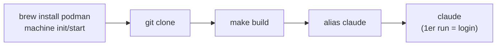

# claude-isolation

Faire tourner **Claude Code** en mode autonome (`--dangerously-skip-permissions`) dans un
sandbox **Podman**, sans exposer la machine à l'exfiltration de secrets ni à la destruction
de données.

> 📐 Modèle de menace complet + décisions d'archi : [`docs/architecture.md`](docs/architecture.md)

## Sommaire
- [Pourquoi](#pourquoi)
- [Architecture](#architecture)
- [Le réseau en détail](#le-réseau-en-détail)
- [Flux MCP (le tunnel socat)](#flux-mcp-le-tunnel-socat)
- [Egress & accès web](#egress--accès-web)
- [Authentification & persistance](#authentification--persistance)
- [Volumes & données](#volumes--données)
- [Structure du repo](#structure-du-repo)
- [Prérequis](#prérequis)
- [Installation](#installation)
- [🧑‍🤝‍🧑 Setup sur la machine d'un collègue](#-setup-sur-la-machine-dun-collègue)
- [Vérifier la config](#vérifier-la-config)
- [Dépannage](#dépannage)
- [TODO / limites connues](#todo--limites-connues)

---

## Pourquoi

Deux hypothèses de travail (détaillées dans le doc d'archi) :

1. **Lethal trifecta** (Simon Willison) : un agent qui combine *données privées* +
   *contenu non fiable* (issues, pages web, code non relu) + *canal de sortie* peut être
   détourné par prompt injection pour exfiltrer des données.
2. **Loi de Murphy de l'agent** : on suppose que l'agent finira par causer tous les dégâts
   qu'il est *capable* de causer (injection **ou** simple erreur).

Conséquence : on ne fait pas confiance à l'agent, on l'enferme dans une boîte d'où il ne
peut ni exfiltrer de secrets, ni détruire de données. **Le code, lui, n'est pas une donnée
sensible** (versionné par git) → il est simplement monté en volume.

---

## Architecture

Trois conteneurs, un **réseau interne sans route internet** (`claude-net`). Seuls les
sidecars B et C ont une seconde patte vers internet ; le conteneur Claude n'en a **aucune**.



| # | Conteneur | Rôle | Internet | Secrets |
|---|-----------|------|----------|---------|
| **A** | `claude` | Claude Code + mise. Le code est monté ici. | ❌ direct — **uniquement** via proxy C | aucun |
| **B** | `mcp-remote` | OAuth des MCP + conversion HTTP↔STDIO | ✅ (serveurs MCP) | **tokens OAuth MCP** |
| **C** | `egress-proxy` | Proxy squid, allowlist de sortie | ✅ (allowlist) | — |

Idée centrale : **les credentials ne sont jamais dans le conteneur qui exécute l'agent.**
Claude voit un MCP « local », mais l'OAuth et les tokens vivent dans B, hors de sa portée.

---

## Le réseau en détail

`claude-net` est créé ainsi :

```sh
podman network create --internal --disable-dns --subnet 10.89.0.0/24 claude-net
```

- **`--internal`** : pas de route vers internet. C'est *la* barrière : le conteneur Claude
  ne peut pas joindre le net directement, donc pas d'exfiltration hors des canaux contrôlés.
- **`--disable-dns` + IP statiques** : point non-évident, **validé à la dure**. Si le DNS
  interne (aardvark) est actif, les sidecars *multi-homed* (interne + externe) héritent du
  resolver interne en tête de `resolv.conf` ; or ce resolver ne forwarde pas vers
  l'extérieur → la résolution DNS externe des sidecars casse et le proxy renvoie
  `HIER_NONE/503`. On désactive donc le DNS et on adresse tout par **IP fixe** :
  `egress-proxy = 10.89.0.10`, `mcp-remote = 10.89.0.11`.
- **Claude n'a jamais besoin de DNS externe** : c'est le proxy qui résout les domaines lors
  du `CONNECT` HTTPS.

Les **sidecars** sont démarrés avec le réseau externe (`podman`) comme réseau *primaire*
(pour avoir internet + un DNS qui marche), puis rattachés à `claude-net` en IP statique :

```sh
podman run -d --name egress-proxy --network podman …
podman network connect --ip 10.89.0.10 claude-net egress-proxy
```

---

## Flux MCP (le tunnel socat)

Claude tourne dans un conteneur isolé, il ne peut pas parler à un process de l'hôte. On
tunnelise donc le MCP en TCP à travers le réseau interne — les credentials OAuth restent
dans le conteneur B :



Côté Claude (`containers/claude/config/mcp.json`), le serveur MCP est déclaré comme une
simple commande `socat` :

```json
{ "mcpServers": {
    "exemple": { "command": "socat", "args": ["STDIO", "TCP:10.89.0.11:9000"] }
}}
```

Côté B, chaque fichier `containers/mcp-remote/servers.d/<nom>.env` déclare un serveur
(URL, port TCP, port de callback OAuth, filtre d'outils optionnel). L'entrypoint de B ouvre
un `socat TCP-LISTEN` par serveur. **Filtrer les outils dangereux** se fait ici
(`ALLOWED_TOOLS`) — on n'expose que ce qui ne peut pas faire de dégâts.

> Aucun serveur n'est branché par défaut (`servers.d` ne contient qu'un `.env.sample`).

---

## Egress & accès web

La seule sortie internet de Claude passe par **squid** (`egress/squid.conf`), en
**allowlist stricte**. Domaines autorisés (Claude Code v2, cf. doc réseau officielle) :

| Domaine | Pourquoi |
|---|---|
| `.anthropic.com` | API + télémétrie Statsig |
| `.claude.ai` | login abonnement + `downloads.claude.ai` (installeur/updates) |
| `.claude.com` | `platform.claude.com` (auth Console) |
| `raw.githubusercontent.com` | notes de version / marketplace de skills |

Tout le reste est **refusé (403)**. La télémétrie et le reporting d'erreurs sont coupés
(`DISABLE_TELEMETRY=1`, `DISABLE_ERROR_REPORTING=1`) pour réduire encore l'egress.

**Est-ce que Claude peut chercher sur le web ?** Trois canaux distincts :



| Canal | Qui fetch | État |
|---|---|---|
| `WebSearch` (intégré) | serveurs Anthropic (server-side) → `api.anthropic.com` | ✅ marche déjà |
| `WebFetch` (intégré) | le CLI **dans le conteneur A** → proxy squid | ⛔ bloqué hors allowlist (*voulu*) |
| MCP de recherche | le conteneur **B** | ⚙️ à brancher si besoin |

Pour un accès web **contrôlé**, on branche un MCP de recherche dans B : la requête part de B
(qui a internet), Claude ne reçoit que le résultat via le tunnel. ⚠️ Rappel : tout outil de
web-egress est *techniquement* un canal d'exfiltration → filtrer / lecture seule.

---

## Authentification & persistance

**Login abonnement uniquement** (pas de clé API). Comme il n'y a pas de navigateur dans le
conteneur, on utilise le **flow « coller le code »** (pas de callback localhost) :



Les credentials sont écrits dans le volume **`claude-home`** monté sur `/home/claude/.claude`
(`CLAUDE_CONFIG_DIR`). À chaque run, l'entrypoint **rafraîchit** la config « managée »
(skills, plugins, `mcp.json`) depuis l'image *sans* toucher à `.credentials.json` → on ne se
logue **qu'une fois**, tout en gardant l'image à jour.

---

## Volumes & données

| Volume | Monté dans | Contenu | Sensible ? |
|---|---|---|---|
| `claude-home` | A (`/home/claude/.claude`) | login abonnement, config | 🔐 oui (isolé de B) |
| `claude-mcp-auth` | **B uniquement** | tokens OAuth des MCP | 🔐 oui (jamais dans A) |
| bind mount `$PWD` | A (`/workspace`) | le code du projet | non (versionné git) |

Les hooks git sont neutralisés dans A (`core.hooksPath` → template éphémère) : un hook
malveillant écrit par l'agent n'est **pas** persisté sur l'hôte (fermeture d'une voie
d'évasion). Idem pour tout fichier non-versionné.

---

## Structure du repo

```
claude-isolation/
├── bin/
│   ├── claude-sandbox.sh          # launcher (alias `claude`) : pull + réseau + sidecars + run -it
│   └── claude-doctor.sh           # diagnostic complet (infra + isolation + auth)
├── containers/
│   ├── claude/
│   │   ├── Containerfile           # image A : node + Claude Code + mise + socat
│   │   ├── entrypoint.sh           # seed config · mise install · hooks · lance claude
│   │   ├── config/mcp.json         # MCP déclarés (socat → 10.89.0.11:9000)
│   │   └── git-hooks-template/     # hooks neutres (anti-évasion)
│   └── mcp-remote/
│       ├── Containerfile           # image B : node + mcp-remote + socat
│       ├── entrypoint.sh           # 1 socat TCP-LISTEN → mcp-remote par serveur
│       └── servers.d/
│           └── example.env.sample  # modèle de serveur MCP OAuth (copier en <nom>.env)
├── egress/
│   └── squid.conf                  # allowlist de sortie du conteneur A
├── Makefile                        # build/push des images
└── docs/architecture.md
```

Réglages centraux (registry, IP, ports, volumes) : en-tête de `bin/claude-sandbox.sh`.

---

## Prérequis

- **macOS** (Apple Silicon testé) — le principe marche aussi sous Linux, sans VM.
- **Homebrew**
- **Podman** (la VM est gérée par `podman machine`)

---

## Installation



```sh
# 1. Podman + VM (provider Apple natif, aucune dépendance externe)
brew install podman
podman machine init --provider applehv
podman machine start

# 2. Récupérer le repo
git clone <ce-repo> ~/Dev/IA/claude-isolation
cd ~/Dev/IA/claude-isolation

# 3. Construire les images (tant qu'il n'y a pas de registry d'équipe)
make build

# 4. Alias dans ton shell rc (~/.zshrc)
alias claude='~/Dev/IA/claude-isolation/bin/claude-sandbox.sh'
alias claude-doctor='~/Dev/IA/claude-isolation/bin/claude-doctor.sh'

# 5. Premier lancement (dans un repo SOUS $HOME, pas /tmp)
cd ~/code/mon-projet
claude          # → login abonnement au 1er run (flow « coller le code »)
```

---

## 🧑‍🤝‍🧑 Setup sur la machine d'un collègue

Le sandbox est **par machine** : chaque personne construit ses images localement et se
connecte avec **son propre** abonnement Claude (ses credentials restent dans *ses* volumes,
rien n'est partagé).

> ℹ️ Tant qu'aucun **registry d'équipe** n'est configuré (`CLAUDE_SANDBOX_REGISTRY`), les
> images ne sont pas poussées : chaque collègue fait `make build` après le clone. Le
> launcher tente un `podman pull` puis retombe sur le cache local si le pull échoue — c'est
> normal en mode « localhost ».

**Étapes pour le collègue :**

```sh
# 1. Podman
brew install podman
podman machine init --provider applehv && podman machine start

# 2. Cloner + builder les images (~5 min la première fois)
git clone <ce-repo> ~/Dev/IA/claude-isolation
cd ~/Dev/IA/claude-isolation
make build

# 3. Alias
echo "alias claude='~/Dev/IA/claude-isolation/bin/claude-sandbox.sh'" >> ~/.zshrc
echo "alias claude-doctor='~/Dev/IA/claude-isolation/bin/claude-doctor.sh'" >> ~/.zshrc
source ~/.zshrc

# 4. Vérifier
claude-doctor      # tout doit être vert sauf « auth » (pas encore loggué)

# 5. Se connecter (son propre compte)
cd ~/un-repo-sous-home
claude             # login abonnement au 1er run → persisté dans SON volume claude-home
```

**Checklist collègue :**
- [ ] Repo de travail **sous `$HOME`** (un mount depuis `/tmp` échoue — cf. dépannage).
- [ ] `claude-doctor` : réseau interne, isolation, allowlist → verts.
- [ ] Login effectué une fois (le doctor passe « auth » au vert ensuite).
- [ ] Pour les **MCP** : chacun fait son propre flow OAuth (stocké dans *son*
      `claude-mcp-auth`). Copier les `servers.d/<nom>.env` nécessaires (non versionnés).

**Quand il y aura un registry d'équipe** (étape suivante, non faite) : `make push` une fois,
puis les collègues n'ont plus qu'à `export CLAUDE_SANDBOX_REGISTRY=<registry>` — le launcher
`podman pull` l'image commune à chaque lancement (skills/plugins toujours à jour), plus
besoin de `make build` local.

---

## Vérifier la config

```sh
claude-doctor          # ou: ~/Dev/IA/claude-isolation/bin/claude-doctor.sh
```

Contrôle en un coup (15 checks) : machine podman, images, réseau `internal=true dns=false`,
sidecars, **blocage internet direct**, **allowlist egress** (anthropic/claude.ai/platform
autorisés, reste refusé), tunnel MCP, et **persistance du login**.

Depuis une session Claude en cours : `/status` (compte, modèle), `/mcp` (serveurs MCP),
`/doctor` (santé interne).

---

## Dépannage

| Symptôme | Cause / fix |
|---|---|
| `Error: statfs /tmp/… no such file or directory` | Podman machine ne monte que `$HOME`. Mets le repo **sous `$HOME`**, ou `podman machine set --volume`. |
| `ERR_SOCKET_CLOSED` / `Unable to connect to Anthropic` | Un domaine requis manque à l'allowlist `egress/squid.conf`. |
| `krunkit: executable file not found` au `machine start` | Réinitialise avec le provider Apple : `podman machine rm -f podman-machine-default && podman machine init --provider applehv`. |
| Proxy `HIER_NONE/503` | DNS des sidecars cassé → réseau doit être `--disable-dns` + IP statiques (déjà géré par le launcher). |
| `The input device is not a TTY` | `claude` doit être lancé depuis un **vrai terminal**, pas un pipe. |
| Login redemandé à chaque run | Le volume `claude-home` n'est pas monté / a été supprimé. |
| `mise install` échoue au démarrage | Les registries ne sont pas dans l'allowlist squid (voir TODO). |

---

## TODO / limites connues

- **Registry d'équipe** : pousser l'image commune (`make push`) pour éviter le `make build`
  local chez chaque collègue et distribuer skills/plugins à jour automatiquement.
- **Enregistrement MCP côté Claude** : `mcp.json` est embarqué mais pas encore enregistré au
  bon endroit (`claude mcp add --scope user` à l'entrypoint) + un vrai serveur dans
  `servers.d/`.
- **`mise install` × egress** : ajouter les registries (npm, mise, github) à l'allowlist si
  installation d'outils au runtime.
- **Audit trail MCP** : viser une MCP gateway centralisée (réponse à incident).
- **Skills/plugins communs** : dossiers à peupler dans l'image (`/opt/claude-dist`).
- **Utilisateurs non-ingénieurs** : le flux (podman, clone, build) reste trop technique.
