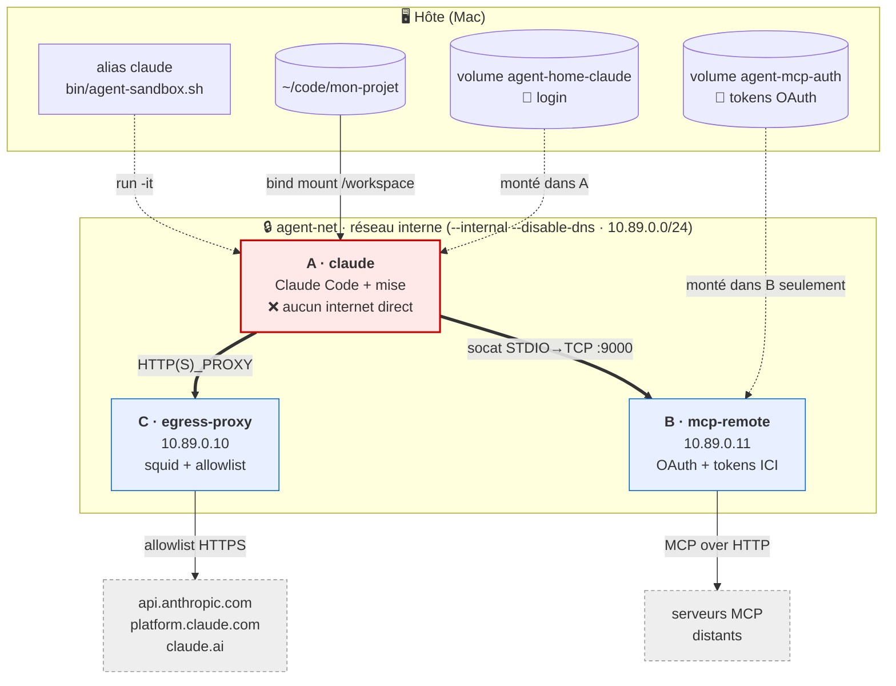
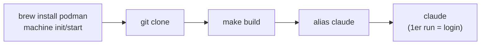

# agent-airlock

Faire tourner **Claude Code** en mode autonome (`--dangerously-skip-permissions`) dans un
sandbox **Podman**, sans exposer la machine à l'exfiltration de secrets ni à la destruction
de données.

> 📐 Modèle de menace + décisions d'archi : [`docs/architecture.md`](docs/architecture.md)
> 📚 Guides & doc technique : [`docs/`](docs/README.md) · [`CONTRIBUTING.md`](CONTRIBUTING.md)

## Sommaire
- [Pourquoi](#pourquoi)
- [Architecture](#architecture)
- [Structure du repo](#structure-du-repo)
- [Prérequis](#prérequis)
- [Installation](#installation)
- [Vérifier la config](#vérifier-la-config)
- [Pour aller plus loin](#pour-aller-plus-loin)
- [TODO / limites connues](#todo--limites-connues)

---

## Pourquoi

Deux hypothèses de travail (détaillées dans le [doc d'archi](docs/architecture.md)) :

1. **Lethal trifecta** (Simon Willison) : un agent qui combine *données privées* +
   *contenu non fiable* (issues, pages web, code non relu) + *canal de sortie* peut être
   détourné par prompt injection pour exfiltrer des données.
2. **Loi de Murphy de l'agent** : on suppose que l'agent finira par causer tous les dégâts
   qu'il est *capable* de causer (injection **ou** simple erreur).

Conséquence : on ne fait pas confiance à l'agent, on l'enferme dans une boîte d'où il ne
peut ni exfiltrer de secrets, ni détruire de données. **Le code, lui, n'est pas une donnée
sensible** (versionné par git) → il est simplement monté en volume.

---

## Architecture

Trois conteneurs, un **réseau interne sans route internet** (`agent-net`). Seuls les
sidecars B et C ont une seconde patte vers internet ; le conteneur Claude n'en a **aucune**.



| # | Conteneur | Rôle | Internet | Secrets |
|---|-----------|------|----------|---------|
| **A** | `claude` | Claude Code + mise. Le code est monté ici. | ❌ direct — **uniquement** via proxy C | aucun |
| **B** | `mcp-remote` / `mcp-proxy` | Proxy MCP avec injection Bearer (tokens pré-importés) | ✅ (serveurs MCP) | **tokens MCP** (sidecar only) |
| **C** | `egress-proxy` | Proxy squid, allowlist de sortie | ✅ (allowlist) | — |

Idée centrale : **les credentials ne sont jamais dans le conteneur qui exécute l'agent.**
Le harness voit un MCP « local » (streamable-http vers le proxy sidecar).
L'OAuth est géré automatiquement par le proxy (PKCE + callback) — l'utilisateur
ouvre juste l'URL affichée dans `podman logs`.

> Détails du câblage → [`docs/reseau.md`](docs/reseau.md) · secrets & login →
> [`docs/authentification.md`](docs/authentification.md) · accès web →
> [`docs/acces-web.md`](docs/acces-web.md).

---

## Structure du repo

```
agent-airlock/
├── bin/
│   ├── agent-sandbox.sh          # launcher générique : profil → build si absent → réseau → sidecars → run
│   ├── agent-doctor.sh           # diagnostic complet (infra + isolation + auth)
│   ├── agent-import-auth.sh      # importe un login (auth.json) fait côté hôte → volume (sélectif)
│   ├── agent-import-config.sh    # seed la config hôte (settings/agents/skills…) → volume (opt-in)
│   └── agent-mcp-wire.sh         # câble les serveurs MCP du mcp.json hôte sur le sidecar
├── lib/
│   └── profiles.sh               # helpers profils (list/load/select/resolve/ensure-image)
├── profiles/
│   ├── claude/                   # profil harness (oauth) — voir docs/profils.md
│   │   ├── profile.env             # variables du harness (bin, config-dir, volume, auth…)
│   │   ├── install.sh              # installe le binaire du harness dans l'image
│   │   ├── allowlist.conf          # domaines de sortie autorisés (allowlist egress du profil)
│   │   └── config/mcp.json         # bundle config seedé (MCP, skills, commandes, plugins)
│   ├── pi/                       # profil harness pi (apikey) — provider-agnostic
│   └── opencode/                 # profil harness opencode (apikey)
├── providers/                    # catalogue de providers (clé + domaine egress couplés)
│   ├── anthropic.env  openai.env  google.env  deepseek.env
│   └── openrouter.env groq.env    mistral.env xai.env
├── containers/
│   ├── base/
│   │   ├── Containerfile           # image socle : node + mise + socat + git + user agent
│   │   ├── entrypoint.sh           # générique : seed config · mise install · hooks · lance $HARNESS_BIN
│   │   └── git-hooks-template/     # hooks neutres (anti-évasion)
│   ├── harness/
│   │   └── Containerfile           # base + install.sh + bundle config (contexte = profiles/<name>)
│   └── mcp-remote/
│       ├── Containerfile           # image sidecar MCP : Node.js proxy (Bearer token injection)
│       ├── entrypoint.sh           # 1 node proxy.js par serveur déclaré dans servers.d/*.env
│       ├── proxy.js                # proxy HTTP minimal (~90 lignes)
│       ├── servers.d/
│       │   └── example.env.sample # modèle de serveur MCP (NAME/URL/PORT)
│       └── servers.d-proxy/       # (généré par agent-mcp-wire.sh, gitignoré)
├── egress/
│   └── squid.base.conf             # socle commun du proxy (ports + deny) ; l'allowlist vient du profil
├── Makefile                        # build/push des images
└── docs/                           # architecture + guides (voir docs/README.md)
```

Réglages centraux (registry, IP, ports, volumes) : en-tête de `bin/agent-sandbox.sh`.

---

## Prérequis

- **macOS** (Apple Silicon testé) — le principe marche aussi sous Linux, sans VM.
- **Homebrew**
- **Podman** (la VM est gérée par `podman machine`)

---

## Installation



```sh
# 1. Podman + VM (provider Apple natif, aucune dépendance externe)
brew install podman
podman machine init --provider applehv
podman machine start

# 2. Récupérer le repo
git clone <ce-repo> ~/agent-airlock
cd ~/agent-airlock

# 3. Construire les images (tant qu'il n'y a pas de registry d'équipe)
make build          # base + harness claude + sidecars ; ou laisse le launcher builder à la volée

# 4. Alias dans ton shell rc (~/.zshrc)
alias claude='~/agent-airlock/bin/agent-sandbox.sh --profile claude'
alias agent-doctor='~/agent-airlock/bin/agent-doctor.sh'
# Variante multi-harness : définir un défaut sans figer d'alias
#   export AGENT_PROFILE=claude        # « toujours ce harness »
#   alias agent='~/agent-airlock/bin/agent-sandbox.sh'   # --profile X override ; --choose force le menu

# 5. Premier lancement (dans un repo SOUS $HOME, pas /tmp)
cd ~/code/mon-projet
claude          # → login abonnement au 1er run (flow « coller le code »)
```

> 🧑‍🤝‍🧑 Installer sur la machine d'un collègue : guide dédié
> [`docs/onboarding.md`](docs/onboarding.md).

---

## Vérifier la config

```sh
agent-doctor          # ou: ~/agent-airlock/bin/agent-doctor.sh
```

Contrôle en un coup (16 checks) : machine podman, **horloge VM** (dérive → logout OAuth), images, réseau `internal=true dns=false`,
sidecars, **blocage internet direct**, **allowlist egress** (anthropic/claude.ai/platform
autorisés, reste refusé), tunnel MCP, et **persistance du login**.

Depuis une session Claude en cours : `/status` (compte, modèle), `/mcp` (serveurs MCP),
`/doctor` (santé interne).

---

## Pour aller plus loin

| Doc | Contenu |
|---|---|
| [`docs/architecture.md`](docs/architecture.md) | Modèle de menace, décisions de design |
| [`docs/profils.md`](docs/profils.md) | Multi-harness : profils, résolution, ajouter un harness (pi, opencode…) |
| [`docs/reseau.md`](docs/reseau.md) | Réseau interne, DNS, IP statiques, tunnel MCP socat |
| [`docs/acces-web.md`](docs/acces-web.md) | WebSearch / WebFetch / MCP : ce que Claude peut fetcher |
| [`docs/authentification.md`](docs/authentification.md) | Login abonnement, resync horloge, volumes |
| [`docs/ajouter-un-mcp.md`](docs/ajouter-un-mcp.md) | Brancher un serveur MCP |
| [`docs/ajouter-un-skill.md`](docs/ajouter-un-skill.md) | Ajouter un skill commun |
| [`docs/ajouter-une-commande.md`](docs/ajouter-une-commande.md) | Slash-commands & plugins |
| [`docs/allowlist-egress.md`](docs/allowlist-egress.md) | Autoriser un domaine de sortie |
| [`docs/build-et-images.md`](docs/build-et-images.md) | Build, images, registry d'équipe |
| [`docs/onboarding.md`](docs/onboarding.md) | Installer sur une nouvelle machine |
| [`docs/troubleshooting.md`](docs/troubleshooting.md) | Dépannage |
| [`CONTRIBUTING.md`](CONTRIBUTING.md) | Workflow, conventions, checklist PR |

---

## TODO / limites connues

- **Registry d'équipe** : pousser l'image commune (`make push`) pour éviter le `make build`
  local chez chaque collègue et distribuer skills/plugins à jour automatiquement.
- **Enregistrement MCP côté Claude** : `mcp.json` est embarqué mais pas encore enregistré au
  bon endroit (`claude mcp add --scope user` à l'entrypoint) + un vrai serveur dans
  `servers.d/`.
- **`mise install` × egress** : ajouter les registries (npm, mise, github) à l'allowlist si
  installation d'outils au runtime.
- **Audit trail MCP** : viser une MCP gateway centralisée (réponse à incident).
- **Skills/plugins communs** : dossiers à peupler dans l'image (`/opt/dist`).
- **Utilisateurs non-ingénieurs** : le flux (podman, clone, build) reste trop technique.

---

## Licence

[MIT](LICENSE) — © 2026 Axel Leclercq. Fais-en ce que tu veux, garde la mention de copyright,
aucune garantie.
