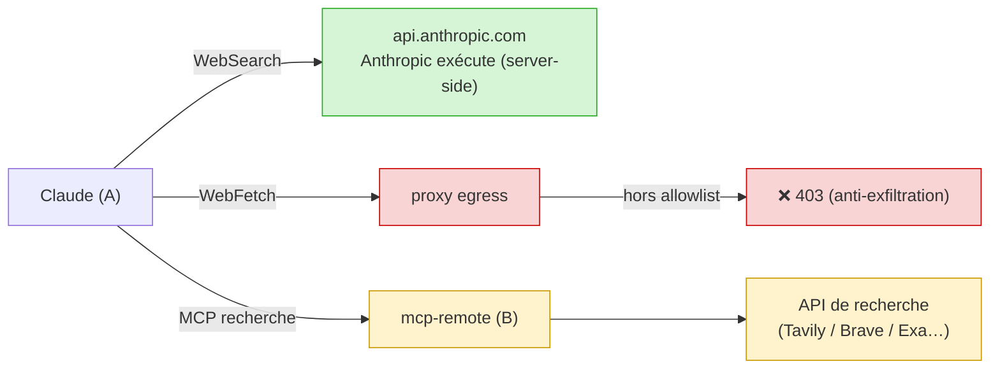

# Accès web de Claude

La seule sortie internet du conteneur A passe par le **proxy squid** (conteneur C), en
**allowlist stricte** (`egress/squid.conf`). Domaines autorisés par défaut (Claude Code v2,
cf. doc réseau officielle) :

| Domaine | Pourquoi |
|---|---|
| `.anthropic.com` | API + télémétrie Statsig |
| `.claude.ai` | login abonnement + `downloads.claude.ai` (installeur/updates) |
| `.claude.com` | `platform.claude.com` (auth Console) |
| `raw.githubusercontent.com` | notes de version / marketplace de skills |

Tout le reste est **refusé (403)**. La télémétrie et le reporting d'erreurs sont coupés
(`DISABLE_TELEMETRY=1`, `DISABLE_ERROR_REPORTING=1`) pour réduire encore l'egress.

> Ajouter un domaine : [`allowlist-egress.md`](allowlist-egress.md).

---

## Est-ce que Claude peut chercher sur le web ?

Oui, mais il faut distinguer **trois canaux** au comportement très différent :

| Canal | Qui fait la requête | État |
|---|---|---|
| `WebSearch` (intégré) | serveurs Anthropic (server-side) → `api.anthropic.com` | ✅ marche déjà |
| `WebFetch` (intégré) | le CLI **dans le conteneur A** → proxy squid | ⛔ bloqué hors allowlist (*voulu*) |
| MCP de recherche | le conteneur **B** | ⚙️ à brancher si besoin |

- **`WebSearch`** est exécuté côté Anthropic : la recherche ne part pas de la machine, seul
  le résultat revient par l'API. Fonctionne sans rien configurer.
- **`WebFetch`** récupère une URL **depuis le conteneur A**, donc via le proxy. Un domaine
  non allowlisté est refusé — c'est **voulu** : laisser Claude fetch n'importe quelle URL
  rouvrirait un canal d'exfiltration.
- **MCP de recherche** : pour un accès web *contrôlé*, on branche un serveur de recherche
  dans B (cf. [`ajouter-un-mcp.md`](ajouter-un-mcp.md)). La requête part de B (qui a
  internet), Claude ne reçoit que le résultat via le tunnel.

## ⚠️ Le compromis

Tout outil de web-egress (search comme fetch) est *techniquement* un canal d'exfiltration :
l'agent peut encoder des données dans une requête. C'est précisément ce que l'allowlist
cherche à empêcher. Si tu ouvres un accès web :

- privilégie un **MCP en lecture seule** filtré (`ALLOWED_TOOLS`) ;
- garde l'allowlist egress la plus étroite possible ;
- ne relâche `WebFetch` que vers des domaines de confiance et documentés.
