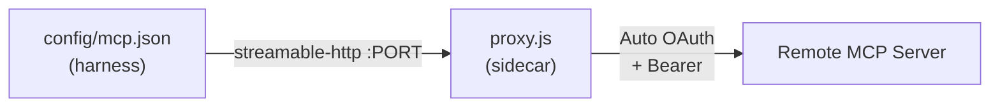

# Adding an MCP Server

An MCP is connected via the **sidecar proxy** (`mcp-remote` or `mcp-proxy`). It's the
proxy that talks to the internet, handles automatic OAuth, and holds the tokens. The
harness only sees a `streamable-http` or `type: url` local endpoint. You need **one
change** on the sidecar + possibly an `mcp.json` update on the harness side.



> 🧭 **Shortcut (especially for pi)**: if you already have an `mcp.json` on the host,
> `bin/agent-mcp-wire.sh --profile <name>` auto-generates the
> `servers.d-proxy/<name>.env` files (ports + CALLBACK_PORT assigned) **and** the
> sandbox `mcp.json`. `localhost` servers are ignored. See
> [`profiles.md`](profiles.md) § MCP. The rest of this doc describes the **manual**
> method (useful for claude/opencode, or for understanding).

---

## 1. Declare the Server on the Sidecar (`servers.d`)

Real `*.env` files are **git-ignored** (they may contain internal URLs).
Copy the template:

```sh
cd containers/mcp-remote/servers.d
cp example.env.sample linear.env      # example: a "linear" MCP
```

Edit `linear.env`:

```sh
NAME=linear                       # readable identifier (logs)
URL=https://mcp.linear.app/sse    # HTTP/SSE endpoint of the MCP server
PORT=9001                         # internal TCP port — UNIQUE per server
CALLBACK_PORT=9911                # OAuth callback port — UNIQUE (see § OAuth)
```

- **`PORT`**: one port per server (`9000`, `9001`, `9002`…). Must match the `mcp.json`
  entry on the harness side.
- **`CALLBACK_PORT`**: port the proxy listens on for the OAuth callback. The launcher
  auto-publishes it VM→host (`127.0.0.1:<PORT>`). Must be **unique** per server.

## 2. Declare the Endpoint on the Harness (`mcp.json`)

### Claude Code (`type: url`)

```json
{
  "mcpServers": {
    "linear": { "type": "url", "url": "http://10.89.0.11:9001" }
  }
}
```

### Opencode (`type: remote`)

```json
{
  "mcp": {
    "linear": { "type": "remote", "url": "http://10.89.0.11:9001", "enabled": true }
  }
}
```

### pi (`streamable-http` transport, via `agent-mcp-wire.sh`)

Use `agent-mcp-wire.sh` (no manual config).

## 3. Apply

`servers.d/*.env` is **bind-mounted** (no rebuild needed). If `mcp.json` is in the image
(claude/opencode) → rebuild needed. Then relaunch:

```sh
# If mcp.json modified in the image:
make build-harness PROFILE=claude
# Recreate the sidecar to reload servers.d:
podman rm -f mcp-remote
# Launch:
cd ~/my-repo && agent --profile claude
```

## 4. First Connection: OAuth

The proxy first attempts automatic OAuth (PKCE + discovery).
**If it works** (compatible servers, rare today):

1. The proxy shows an authorization URL in `podman logs mcp-proxy`.
2. Open the URL in your browser → you authorize.
3. The callback lands on the published port, the token is saved.
4. **Subsequent runs**: token reused, zero interaction.

**If it doesn't work** (the majority of servers: Jira, Datadog…):

1. The proxy shows instructions in `podman logs mcp-proxy`.
2. **On the host** (not in the sandbox), run your harness normally:
   ```sh
   pi                # or claude, or opencode
   /mcp:auth jira    # → browser → authorize
   ```
3. Import the token to the sidecar:
   ```sh
   ~/agent-airlock/bin/agent-import-auth.sh --profile pi --mcp jira
   ```
4. The proxy auto-detects the token (5s poll) → MCP becomes usable. **No restart needed.**

> 💡 On MCP errors in the harness, always check first:
> `podman logs mcp-proxy` (pi) or `podman logs mcp-remote` (claude/opencode).

---

## ⚠️ Multiple OAuth MCPs

No launcher-side setup: it **auto-derives and publishes** the callback ports of all
`servers.d/*.env` + `servers.d-proxy/*.env` at each startup. To add a second (or Nth)
OAuth MCP:

1. Give it a **distinct** `CALLBACK_PORT` (e.g. `9911`, `9912`…) in its `.env`.
2. Recreate the sidecar to republish the ports: `podman rm -f mcp-remote` (or
   `mcp-proxy`), then relaunch the harness.

The launcher **warns** (WARN) if two servers declare the same `CALLBACK_PORT` (one of the
two OAuth flows would fail).

## Troubleshooting

| Symptom | Cause |
|---|---|
| `/mcp` shows "failed" / "has no OAuth config" | Token not yet imported. Check `podman logs mcp-proxy` (pi) or `mcp-remote` (claude/opencode) for instructions. |
| Automatic OAuth never opens | Most servers don't support standard discovery. Follow the instructions in `podman logs`. |
| MCP server doesn't resolve | The sidecar has direct internet access. Check the URL in `servers.d/<name>.env`. |
