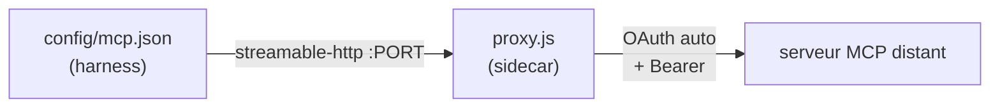

# Ajouter un serveur MCP

Un MCP est branché via le **sidecar proxy** (`mcp-remote` ou `mcp-proxy`). C'est lui qui
parle à internet, fait l'OAuth automatiquement, et détient les tokens. Le harness ne voit
qu'un endpoint `streamable-http` ou `type: url` local. Il faut **une modification** côté
sidecar + éventuellement une mise à jour du `mcp.json` côté harness.



> 🧭 **Raccourci (surtout pour pi)** : si tu as déjà un `mcp.json` côté hôte, `bin/agent-mcp-wire.sh
> --profile <name>` génère tout seul les `servers.d-proxy/<nom>.env` (ports + CALLBACK_PORT
> assignés) **et** le `mcp.json` sandbox. Les serveurs `localhost` sont ignorés. Voir
> [`profils.md`](profils.md) § MCP. La suite de ce doc décrit la méthode **manuelle** (utile
> pour claude/opencode, ou pour comprendre).

---

## 1. Déclarer le serveur côté sidecar (`servers.d`)

Les fichiers `*.env` réels sont **git-ignorés** (ils peuvent contenir des URLs internes).
Copie le modèle :

```sh
cd containers/mcp-remote/servers.d
cp example.env.sample linear.env      # exemple : un MCP « linear »
```

Édite `linear.env` :

```sh
NAME=linear                       # identifiant lisible (logs)
URL=https://mcp.linear.app/sse    # endpoint HTTP/SSE du serveur MCP
PORT=9001                         # port TCP interne — UNIQUE par serveur
CALLBACK_PORT=9911                # port de callback OAuth — UNIQUE (voir § OAuth)
```

- **`PORT`** : un port par serveur (`9000`, `9001`, `9002`…). Doit matcher l'entrée
  `mcp.json` côté harness.
- **`CALLBACK_PORT`** : port sur lequel le proxy écoute le callback OAuth. Le launcher
  le publie automatiquement VM→hôte (`127.0.0.1:<PORT>`). Doit être **unique** par serveur.

## 2. Déclarer le endpoint côté harness (`mcp.json`)

### Claude Code (`type: url`)

```json
{
  "mcpServers": {
    "linear": { "type": "url", "url": "http://10.89.0.11:9001" }
  }
}
```

### Opencode (`type: remote`)

```json
{
  "mcp": {
    "linear": { "type": "remote", "url": "http://10.89.0.11:9001", "enabled": true }
  }
}
```

### pi (transport `streamable-http`, via `agent-mcp-wire.sh`)

Utilise `agent-mcp-wire.sh` (pas de config manuelle).

## 3. Appliquer

`servers.d/*.env` est **bind-monté** (pas besoin de rebuild). Si le `mcp.json` est dans
l'image (claude/opencode) → rebuild nécessaire. Puis relancer :

```sh
# Si mcp.json modifié dans l'image :
make build-harness PROFILE=claude
# Recréer le sidecar pour recharger servers.d :
podman rm -f mcp-remote
# Lancer :
cd ~/mon-repo && agent --profile claude
```

## 4. Première connexion : OAuth

Le proxy tente d'abord l'OAuth automatique (PKCE + discovery).
**Si ça marche** (serveurs compatibles, rare aujourd'hui) :

1. Le proxy affiche une URL d'autorisation dans `podman logs mcp-proxy`.
2. Ouvre l'URL dans ton navigateur → tu autorises.
3. Le callback atterrit sur le port publié, le token est sauvegardé.
4. **Runs suivants** : token réutilisé, zéro interaction.

**Si ça ne marche pas** (la majorité des serveurs : Jira, Datadog…) :

1. Le proxy affiche les instructions dans `podman logs mcp-proxy`.
2. **Sur l'hôte** (pas dans le sandbox), lance ton harness normalement :
   ```sh
   pi                # ou claude, ou opencode
   /mcp:auth jira    # → navigateur → autorise
   ```
3. Importe le token vers le sidecar :
   ```sh
   ~/agent-airlock/bin/agent-import-auth.sh --profile pi --mcp jira
   ```
4. Le proxy détecte le token automatiquement (poll toutes les 5s) → le MCP
   devient utilisable. **Aucun redémarrage nécessaire.**

> 💡 En cas d'erreur MCP dans le harness, toujours vérifier d'abord :
> `podman logs mcp-proxy` (pi) ou `podman logs mcp-remote` (claude/opencode).

---

## ⚠️ Plusieurs MCP OAuth

Aucune manip côté launcher : il **dérive et publie automatiquement** les ports de callback de
tous les `servers.d/*.env` + `servers.d-proxy/*.env` à chaque démarrage. Pour ajouter un
second (ou Nième) MCP OAuth :

1. Donne-lui un `CALLBACK_PORT` **distinct** (ex. `9911`, `9912`…) dans son `.env`.
2. Recrée le sidecar pour qu'il republie les ports : `podman rm -f mcp-remote` (ou
   `mcp-proxy`), puis relance le harness.

Le launcher **avertit** (WARN) si deux serveurs déclarent le même `CALLBACK_PORT` (l'un des
deux OAuth échouerait).

## Dépannage

| Symptôme | Cause |
|---|---|
| `/mcp` montre « failed » / « has no OAuth config » | Token pas encore importé. Vérifie `podman logs mcp-proxy` (pi) ou `mcp-remote` (claude/opencode) pour les instructions. |
| L'OAuth automatique ne s'ouvre jamais | La plupart des serveurs ne supportent pas la discovery standard. Suis les instructions dans `podman logs`. |
| Le serveur MCP ne résout pas | Le sidecar a un accès internet direct. Vérifie l'URL dans `servers.d/<nom>.env`. |
