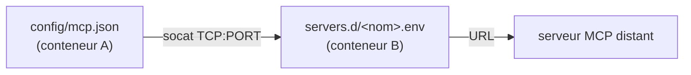

# Ajouter un serveur MCP

Un MCP est branché via le **conteneur B (`mcp-remote`)** : c'est lui qui parle à internet et
qui détient les tokens OAuth. Claude, dans le conteneur A, ne voit qu'un tunnel `socat`. Il
faut donc **deux modifications coordonnées** + un redémarrage.



Le lien entre les deux côtés, c'est le **PORT** : il doit être identique dans `mcp.json` et
dans le `.env`.

---

## 1. Déclarer le serveur côté B (`servers.d`)

Les fichiers `*.env` réels sont **git-ignorés** (ils peuvent contenir des URLs internes).
Copie le modèle :

```sh
cd containers/mcp-remote/servers.d
cp example.env.sample linear.env      # exemple : un MCP « linear »
```

Édite `linear.env` :

```sh
NAME=linear                       # identifiant lisible (logs)
URL=https://mcp.linear.app/sse    # endpoint HTTP/SSE du serveur MCP
PORT=9001                         # port TCP interne — UNIQUE par serveur (voir plus bas)
CALLBACK_PORT=9910                # port de callback OAuth (voir « OAuth » plus bas)
ALLOWED_TOOLS=search,read         # optionnel : filtre les tools (retire les destructeurs)
```

- **`PORT`** : choisis un port libre, **un par serveur** (`9000`, `9001`, `9002`…). Il doit
  matcher l'entrée `mcp.json` côté A.
- **`ALLOWED_TOOLS`** : fortement recommandé. On n'expose que les tools sûrs (lecture,
  recherche) et on retire tout ce qui peut détruire/écrire. C'est *la* couche de réduction
  de surface du canal MCP.

## 2. Déclarer le tunnel côté A (`mcp.json`)

Édite `containers/claude/config/mcp.json` — ajoute une entrée qui pointe vers l'IP statique
du conteneur B (`10.89.0.11`) et le **même PORT** :

```json
{
  "mcpServers": {
    "exemple": { "command": "socat", "args": ["STDIO", "TCP:10.89.0.11:9000"] },
    "linear":  { "command": "socat", "args": ["STDIO", "TCP:10.89.0.11:9001"] }
  }
}
```

## 3. Appliquer

`servers.d` est **bind-monté** (pas besoin de rebuild), mais `mcp.json` est **cuit dans
l'image** → il faut rebuilder A. Puis relancer :

```sh
make build-claude            # embarque le nouveau mcp.json
podman rm -f mcp-remote      # force la relecture de servers.d au prochain run
cd ~/mon-repo && claude
```

## 4. Première connexion : OAuth

À la première utilisation de l'outil, `mcp-remote` lance le flow OAuth. Le callback écoute
sur `CALLBACK_PORT` dans le conteneur B, **publié automatiquement sur l'hôte** en
`127.0.0.1:<CALLBACK_PORT>` par le launcher (il dérive les ports de tous les `servers.d/*.env`
au démarrage). Ouvre l'URL affichée dans ton navigateur (sur le Mac), autorise → le token est
mis en cache dans le volume **`claude-mcp-auth`** (isolé dans B, jamais visible par Claude).

Vérifie ensuite dans une session Claude :
```
/mcp        → le serveur doit apparaître « connected »
```

---

## ⚠️ Plusieurs MCP OAuth

Aucune manip côté launcher : il **dérive et publie automatiquement** les ports de callback de
tous les `servers.d/*.env` à chaque démarrage. Pour ajouter un second (ou Nième) MCP OAuth :

1. donne-lui un `CALLBACK_PORT` **distinct** (ex. `9911`, `9912`…) dans son `.env` ;
2. recrée le sidecar pour qu'il republie les ports : `podman rm -f mcp-remote`, puis relance
   `claude`.

Le launcher **avertit** (WARN) si deux serveurs déclarent le même `CALLBACK_PORT` (l'un des
deux OAuth échouerait). Un MCP **sans OAuth** (token statique dans l'URL, ou pas d'auth) n'a
pas besoin de callback : laisse `CALLBACK_PORT` vide.

## Dépannage

| Symptôme | Cause |
|---|---|
| `/mcp` montre « failed » | PORT différent entre `mcp.json` et le `.env`, ou sidecar pas redémarré. |
| L'OAuth ne s'ouvre jamais | `CALLBACK_PORT` non publié sur l'hôte (voir limite ci-dessus). |
| Le serveur MCP ne résout pas | Le domaine du serveur MCP n'a pas besoin d'allowlist (B a internet), mais vérifie l'URL. |
| Tool destructeur exposé | Ajoute/restreins `ALLOWED_TOOLS`. |
