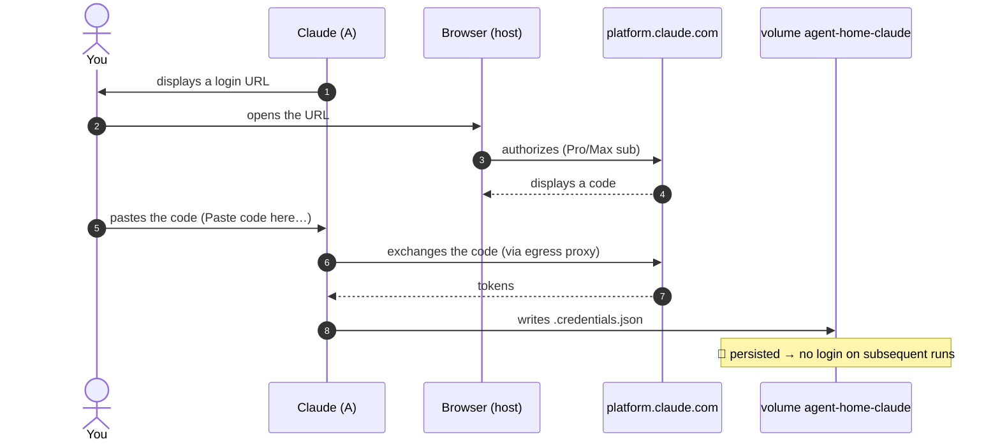

# Authentication, Credentials & Persistence

Auth depends on the **profile mode** (`HARNESS_AUTH_MODE` in `profiles/<name>/profile.env`):

| Mode | Harness type | Mechanism |
|---|---|---|
| `oauth` | Claude Code | browser login "paste the code" + credentials persisted in a volume |
| `apikey` | pi, opencode… | API keys injected at run (selective passthrough), no interactive login |

## Subscription Login (Mode `oauth`, "Paste the Code" Flow)

**Subscription login only** (no API key). Since there's no browser in the container, we use
the **"paste the code"** flow (no localhost callback):



Credentials are written to the **`agent-home-claude`** volume mounted at
`/home/agent/.claude` (`CLAUDE_CONFIG_DIR`). On each run, the entrypoint **refreshes**
the "managed" config (skills, plugins, `mcp.json`) from the image *without* touching
`.credentials.json` → you log in **only once**, while keeping the image up to date.

## Clock Resync (macOS, `oauth` Mode Only)

The `podman machine` **drifts** after Mac sleep (`System clock synchronized: no`).
A skewed clock causes freshly-issued OAuth tokens to be rejected (`iat` in the future) →
**immediate logout** of Claude. The launcher therefore resyncs the VM to the host time
at each launch **in `oauth` mode** (skipped in `apikey`):

```sh
podman machine ssh "sudo date -u -s '@$(date -u +%s)'"
```

If you get logged out for no reason just after waking your Mac, that's the symptom:
relaunch `claude` (the resync runs at startup). `agent-doctor` flags a clock gap > 5 s.

## API Keys (Mode `apikey`)

Harnesses without OAuth (pi, opencode…) authenticate via **API key**. The launcher injects
these keys into the container via **selective passthrough**: only the names listed in
`HARNESS_ENV_KEYS` cross the boundary — **never the whole host env**.

**Two sources**, in priority order:

1. **`profiles/<name>/secrets.env`** (gitignored, takes priority) — local key file.
2. **Host env** (fallback) — if the key is not in `secrets.env`.

```bash
# profiles/pi/profile.env
HARNESS_AUTH_MODE="apikey"
HARNESS_ENV_KEYS="ANTHROPIC_API_KEY OPENAI_API_KEY"   # name allowlist
```

```bash
# profiles/pi/secrets.env   (copy of secrets.env.sample, DO NOT commit)
ANTHROPIC_API_KEY=sk-ant-...
# OPENAI_API_KEY left empty here → taken from host env if present
```

A key present in `secrets.env` but **absent** from `HARNESS_ENV_KEYS` is **not** injected
(the name allowlist is authoritative). `agent-doctor` checks that each declared key is
resolvable (without displaying its value).

In `apikey` mode, **clock resync is skipped** (no timestamped tokens involved) and there
are no persisted credentials to manage.

## Volumes & Data

| Volume | Mounted in | Content | Sensitive? |
|---|---|---|---|
| `agent-home-claude` | A (`/home/agent/.claude`) | subscription login, config | 🔐 yes (isolated from B) |
| `agent-mcp-auth` | **B only** | MCP OAuth tokens | 🔐 yes (never in A) |
| bind mount `$PWD` | A (`/workspace`) | project code | no (git-versioned) |

Principle: **credentials never live in the container running the agent.** The subscription
login is in `agent-home-claude` (container A, but the agent can't egress anyway), MCP
tokens in `agent-mcp-auth` (mounted **only** in B).

Git hooks are neutralized in A (`core.hooksPath` → ephemeral template): a malicious hook
written by the agent is **not** persisted on the host (closing an escape path). Same for
any non-versioned file.

## Resetting Login

```sh
podman volume rm agent-home-claude        # forgets subscription login
podman volume rm agent-mcp-auth    # forgets MCP tokens
```

On next `claude`, the volume is recreated and re-seeded, and login is prompted again.

## See Also

- [`web-access.md`](web-access.md) — where auth traffic goes (egress proxy).
- [`troubleshooting.md`](troubleshooting.md) — "login prompted on every run", etc.
