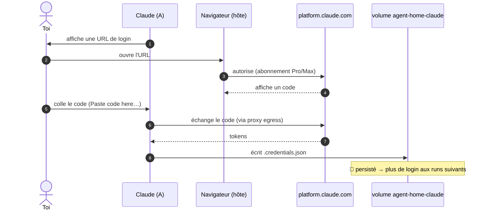

# Authentification, credentials & persistance

L'auth dépend du **mode du profil** (`HARNESS_AUTH_MODE` dans `profiles/<name>/profile.env`) :

| Mode | Harness type | Mécanisme |
|---|---|---|
| `oauth` | Claude Code | login navigateur « coller le code » + credentials persistés dans un volume |
| `apikey` | pi, opencode… | clés d'API injectées au run (passthrough sélectif), pas de login interactif |

## Login abonnement (mode `oauth`, flow « coller le code »)

**Login abonnement uniquement** (pas de clé API). Comme il n'y a pas de navigateur dans le
conteneur, on utilise le flow **« coller le code »** (pas de callback localhost) :



Les credentials sont écrits dans le volume **`agent-home-claude`** monté sur `/home/agent/.claude`
(`CLAUDE_CONFIG_DIR`). À chaque run, l'entrypoint **rafraîchit** la config « managée »
(skills, plugins, `mcp.json`) depuis l'image *sans* toucher à `.credentials.json` → on ne se
logue **qu'une fois**, tout en gardant l'image à jour.

## Resync de l'horloge (macOS, mode `oauth` uniquement)

La `podman machine` **dérive** après une veille du Mac (`System clock synchronized: no`).
Une horloge décalée fait rejeter le token OAuth fraîchement émis (`iat` dans le futur) →
**logout immédiat** de Claude. Le launcher recale donc la VM sur l'heure de l'hôte à chaque
lancement **en mode `oauth`** (sauté en `apikey`) :

```sh
podman machine ssh "sudo date -u -s '@$(date -u +%s)'"
```

Si tu es déconnecté sans raison juste après un réveil du Mac, c'est ce symptôme : relance
`claude` (le resync s'exécute au démarrage). `agent-doctor` signale un écart d'horloge > 5 s.

## Clés d'API (mode `apikey`)

Les harness sans OAuth (pi, opencode…) s'authentifient par **clé d'API**. Le launcher
injecte ces clés dans le conteneur en **passthrough sélectif** : seuls les noms listés dans
`HARNESS_ENV_KEYS` franchissent la frontière — **jamais tout l'env de l'hôte**.

**Deux sources**, dans cet ordre de priorité :

1. **`profiles/<name>/secrets.env`** (gitignoré, prioritaire) — fichier local de clés.
2. **Env de l'hôte** (fallback) — si la clé n'est pas dans `secrets.env`.

```bash
# profiles/pi/profile.env
HARNESS_AUTH_MODE="apikey"
HARNESS_ENV_KEYS="ANTHROPIC_API_KEY OPENAI_API_KEY"   # allowlist de noms
```

```bash
# profiles/pi/secrets.env   (copie de secrets.env.sample, NE PAS commiter)
ANTHROPIC_API_KEY=sk-ant-...
# OPENAI_API_KEY laissé vide ici → pris depuis l'env de l'hôte s'il existe
```

Une clé présente dans `secrets.env` mais **absente** de `HARNESS_ENV_KEYS` n'est **pas**
injectée (l'allowlist de noms fait foi). `agent-doctor` vérifie que chaque clé déclarée est
résoluble (sans afficher sa valeur).

En mode `apikey`, le **resync d'horloge est sauté** (aucun token horodaté en jeu) et il n'y a
pas de credentials persistés à gérer.

## Volumes & données

| Volume | Monté dans | Contenu | Sensible ? |
|---|---|---|---|
| `agent-home-claude` | A (`/home/agent/.claude`) | login abonnement, config | 🔐 oui (isolé de B) |
| `agent-mcp-auth` | **B uniquement** | tokens OAuth des MCP | 🔐 oui (jamais dans A) |
| bind mount `$PWD` | A (`/workspace`) | le code du projet | non (versionné git) |

Principe : **les credentials ne vivent jamais dans le conteneur qui exécute l'agent.** Le
login abonnement est dans `agent-home-claude` (conteneur A, mais l'agent ne peut de toute façon pas
sortir avec), les tokens MCP dans `agent-mcp-auth` (monté **seulement** dans B).

Les hooks git sont neutralisés dans A (`core.hooksPath` → template éphémère) : un hook
malveillant écrit par l'agent n'est **pas** persisté sur l'hôte (fermeture d'une voie
d'évasion). Idem pour tout fichier non-versionné.

## Réinitialiser le login

```sh
podman volume rm agent-home-claude        # oublie le login abonnement
podman volume rm agent-mcp-auth    # oublie les tokens MCP
```

Au prochain `claude`, le volume est recréé et re-seedé, et le login est redemandé.

## Voir aussi

- [`acces-web.md`](acces-web.md) — par où sort le trafic d'auth (proxy egress).
- [`troubleshooting.md`](troubleshooting.md) — « login redemandé à chaque run », etc.
