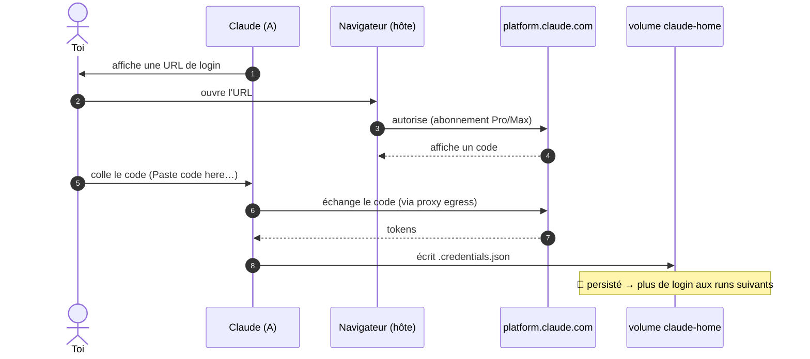

# Authentification, credentials & persistance

## Login abonnement (flow « coller le code »)

**Login abonnement uniquement** (pas de clé API). Comme il n'y a pas de navigateur dans le
conteneur, on utilise le flow **« coller le code »** (pas de callback localhost) :



Les credentials sont écrits dans le volume **`claude-home`** monté sur `/home/claude/.claude`
(`CLAUDE_CONFIG_DIR`). À chaque run, l'entrypoint **rafraîchit** la config « managée »
(skills, plugins, `mcp.json`) depuis l'image *sans* toucher à `.credentials.json` → on ne se
logue **qu'une fois**, tout en gardant l'image à jour.

## Resync de l'horloge (macOS)

La `podman machine` **dérive** après une veille du Mac (`System clock synchronized: no`).
Une horloge décalée fait rejeter le token OAuth fraîchement émis (`iat` dans le futur) →
**logout immédiat** de Claude. Le launcher recale donc la VM sur l'heure de l'hôte à chaque
lancement :

```sh
podman machine ssh "sudo date -u -s '@$(date -u +%s)'"
```

Si tu es déconnecté sans raison juste après un réveil du Mac, c'est ce symptôme : relance
`claude` (le resync s'exécute au démarrage). `claude-doctor` signale un écart d'horloge > 5 s.

## Volumes & données

| Volume | Monté dans | Contenu | Sensible ? |
|---|---|---|---|
| `claude-home` | A (`/home/claude/.claude`) | login abonnement, config | 🔐 oui (isolé de B) |
| `claude-mcp-auth` | **B uniquement** | tokens OAuth des MCP | 🔐 oui (jamais dans A) |
| bind mount `$PWD` | A (`/workspace`) | le code du projet | non (versionné git) |

Principe : **les credentials ne vivent jamais dans le conteneur qui exécute l'agent.** Le
login abonnement est dans `claude-home` (conteneur A, mais l'agent ne peut de toute façon pas
sortir avec), les tokens MCP dans `claude-mcp-auth` (monté **seulement** dans B).

Les hooks git sont neutralisés dans A (`core.hooksPath` → template éphémère) : un hook
malveillant écrit par l'agent n'est **pas** persisté sur l'hôte (fermeture d'une voie
d'évasion). Idem pour tout fichier non-versionné.

## Réinitialiser le login

```sh
podman volume rm claude-home        # oublie le login abonnement
podman volume rm claude-mcp-auth    # oublie les tokens MCP
```

Au prochain `claude`, le volume est recréé et re-seedé, et le login est redemandé.

## Voir aussi

- [`acces-web.md`](acces-web.md) — par où sort le trafic d'auth (proxy egress).
- [`troubleshooting.md`](troubleshooting.md) — « login redemandé à chaque run », etc.
