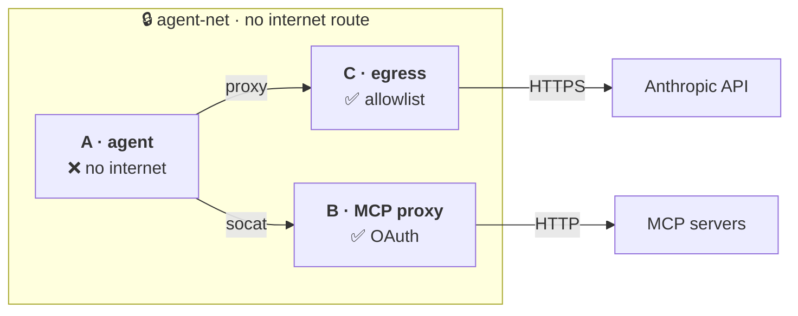

# agent-airlock

<div class="hero" markdown>

Run **Claude Code** in autonomous mode inside a **Podman sandbox** — without exposing your host to secret exfiltration or data destruction.

```sh
brew install podman && podman machine init --provider applehv && podman machine start
git clone https://github.com/Akeuuh/agent-airlock ~/agent-airlock
cd ~/agent-airlock && make build
alias claude='~/agent-airlock/bin/agent-sandbox.sh --profile claude'
```

</div>

<div class="grid cards" markdown>

-   :material-rocket-launch:{ .lg .middle } **I'm new here**

    ---

    Install the sandbox and run your first agent in 5 minutes.

    [:octicons-arrow-right-24: Quick Start](get-started.md)

-   :material-wrench:{ .lg .middle } **I want to configure something**

    ---

    Add an MCP server, a skill, a command, authorize a domain…

    [:octicons-arrow-right-24: How-To Guides](add-mcp.md)

-   :material-brain:{ .lg .middle } **I want to understand**

    ---

    Architecture, threat model, network design, profiles.

    [:octicons-arrow-right-24: Reference](architecture.md)

-   :material-lifebuoy:{ .lg .middle } **Something's not working**

    ---

    Common issues and how to fix them.

    [:octicons-arrow-right-24: Troubleshooting](troubleshooting.md)

</div>

---

## What is agent-airlock?

A lightweight Podman sandbox that isolates your coding agent from your machine. Three containers, one internal network, zero trust in the agent.



- **Container A** runs the agent (no internet, no secrets)
- **Container B** holds MCP tokens and proxies requests (the agent never sees them)
- **Container C** is an egress proxy with a strict domain allowlist

[:fontawesome-solid-book: Read the full architecture](architecture.md){ .md-button }

---

## Why?

Two principles from real-world incidents drive the design:

| Principle | Consequence |
|---|---|
| **Lethal Trifecta** (Simon Willison) — an agent with private data + untrusted content + an output channel = exfiltration | Don't let the agent access secrets or the internet directly |
| **Agent Murphy's Law** — assume the agent will eventually cause all damage it's capable of | Don't let the agent destroy anything that isn't versioned |

> Source code is **not** considered sensitive (it's versioned). It's simply bind-mounted.

---

## Supported Agents

| Agent | Auth | Status |
|---|---|---|
| Claude Code | OAuth (browser login) | :material-check: stable |
| [pi](https://github.com/earendil-works/pi) | API key | :material-check: stable |
| [opencode](https://github.com/sst/opencode) | API key | :material-check: stable |

[:fontawesome-solid-puzzle-piece: Add your own agent](profiles.md){ .md-button }

---

## Contribute

[:fontawesome-solid-code-pull-request: Contributing guide](../CONTRIBUTING.md){ .md-button }
