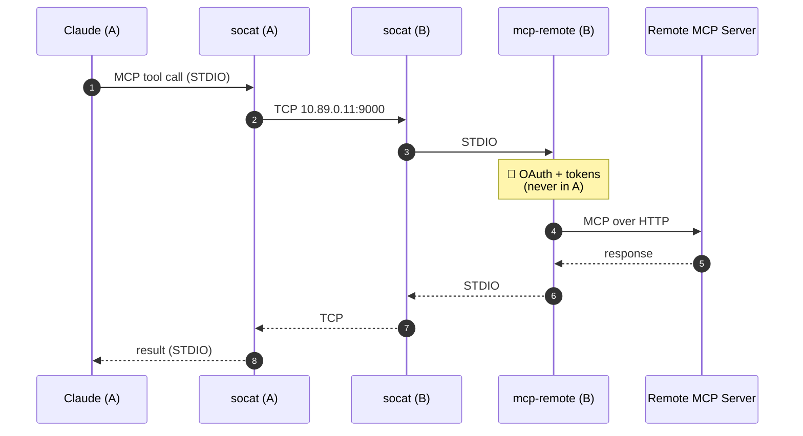

# Network & MCP Tunnel (The Wiring)

How the plumbing isolates Claude while letting it talk to MCPs and the Anthropic API.
The *why* is in [`architecture.md`](architecture.md); here is the *how*.

## The Internal Network

`agent-net` is created like this:

```sh
podman network create --internal --disable-dns --subnet 10.89.0.0/24 agent-net
```

- **`--internal`**: no route to the internet. This is *the* barrier: the Claude container
  cannot reach the net directly, so no exfiltration outside controlled channels.
- **`--disable-dns` + static IPs**: non-obvious point, **battle-tested**. If the internal
  DNS (aardvark) is enabled, *multi-homed* sidecars (internal + external) inherit the
  internal resolver at the top of `resolv.conf`; but this resolver does not forward to
  the outside → the sidecars' external DNS resolution breaks and the proxy returns
  `HIER_NONE/503`. So DNS is disabled and everything is addressed by **fixed IP**:
  `egress-proxy = 10.89.0.10`, `mcp-remote = 10.89.0.11`.
- **Claude never needs external DNS**: the proxy resolves domains during `CONNECT` HTTPS.

**Sidecars** are started with the external network (`podman`) as their *primary* network
(for internet + a working DNS), then attached to `agent-net` with a static IP:

```sh
podman run -d --name egress-proxy --network podman …
podman network connect --ip 10.89.0.10 agent-net egress-proxy
```

On Claude's side, HTTP(S) egress is forced through the proxy via the `run` environment:
`HTTP_PROXY`/`HTTPS_PROXY = http://10.89.0.10:3128`, and `NO_PROXY = 10.89.0.11,localhost`
(so the MCP tunnel doesn't go through the proxy).

## The MCP Tunnel (socat)

Claude runs in an isolated container, it cannot talk to a host process. The MCP is
therefore tunneled over TCP through the internal network — OAuth credentials stay in
container B:



On Claude's side (`profiles/claude/config/mcp.json`), the MCP server is declared as a
simple `socat` command:

```json
{ "mcpServers": {
    "example": { "command": "socat", "args": ["STDIO", "TCP:10.89.0.11:9000"] }
}}
```

On side B, each `containers/mcp-remote/servers.d/<name>.env` file declares a server
(URL, TCP port, OAuth callback port, optional tool filter). B's entrypoint opens a
`socat TCP-LISTEN` per server. **Filtering dangerous tools** happens here
(`ALLOWED_TOOLS`) — only expose what can't cause damage.

> No server is connected by default (`servers.d` only contains a `.env.sample`).
> To add one: [`add-mcp.md`](add-mcp.md).

## See Also

- [`egress-allowlist.md`](egress-allowlist.md) — the proxy allowlist.
- [`web-access.md`](web-access.md) — Claude's web access channels.
- [`troubleshooting.md`](troubleshooting.md) — `HIER_NONE/503`, DNS, etc.
