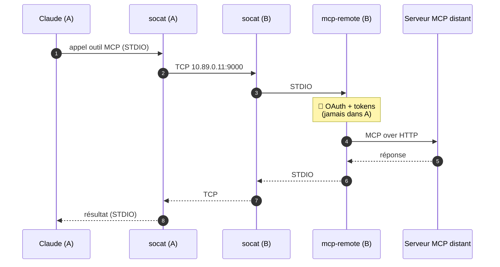

# Réseau & tunnel MCP (le câblage)

Comment la plomberie isole Claude tout en le laissant parler aux MCP et à l'API Anthropic.
Le *pourquoi* est dans [`architecture.md`](architecture.md) ; ici c'est le *comment*.

## Le réseau interne

`claude-net` est créé ainsi :

```sh
podman network create --internal --disable-dns --subnet 10.89.0.0/24 claude-net
```

- **`--internal`** : pas de route vers internet. C'est *la* barrière : le conteneur Claude
  ne peut pas joindre le net directement, donc pas d'exfiltration hors des canaux contrôlés.
- **`--disable-dns` + IP statiques** : point non-évident, **validé à la dure**. Si le DNS
  interne (aardvark) est actif, les sidecars *multi-homed* (interne + externe) héritent du
  resolver interne en tête de `resolv.conf` ; or ce resolver ne forwarde pas vers
  l'extérieur → la résolution DNS externe des sidecars casse et le proxy renvoie
  `HIER_NONE/503`. On désactive donc le DNS et on adresse tout par **IP fixe** :
  `egress-proxy = 10.89.0.10`, `mcp-remote = 10.89.0.11`.
- **Claude n'a jamais besoin de DNS externe** : c'est le proxy qui résout les domaines lors
  du `CONNECT` HTTPS.

Les **sidecars** sont démarrés avec le réseau externe (`podman`) comme réseau *primaire*
(pour avoir internet + un DNS qui marche), puis rattachés à `claude-net` en IP statique :

```sh
podman run -d --name egress-proxy --network podman …
podman network connect --ip 10.89.0.10 claude-net egress-proxy
```

Côté Claude, la sortie HTTP(S) est forcée vers le proxy via l'environnement du `run` :
`HTTP_PROXY`/`HTTPS_PROXY = http://10.89.0.10:3128`, et `NO_PROXY = 10.89.0.11,localhost`
(pour que le tunnel MCP ne parte pas dans le proxy).

## Le tunnel MCP (socat)

Claude tourne dans un conteneur isolé, il ne peut pas parler à un process de l'hôte. On
tunnelise donc le MCP en TCP à travers le réseau interne — les credentials OAuth restent
dans le conteneur B :



Côté Claude (`containers/claude/config/mcp.json`), le serveur MCP est déclaré comme une
simple commande `socat` :

```json
{ "mcpServers": {
    "exemple": { "command": "socat", "args": ["STDIO", "TCP:10.89.0.11:9000"] }
}}
```

Côté B, chaque fichier `containers/mcp-remote/servers.d/<nom>.env` déclare un serveur
(URL, port TCP, port de callback OAuth, filtre d'outils optionnel). L'entrypoint de B ouvre
un `socat TCP-LISTEN` par serveur. **Filtrer les outils dangereux** se fait ici
(`ALLOWED_TOOLS`) — on n'expose que ce qui ne peut pas faire de dégâts.

> Aucun serveur n'est branché par défaut (`servers.d` ne contient qu'un `.env.sample`).
> Pour en ajouter un : [`ajouter-un-mcp.md`](ajouter-un-mcp.md).

## Voir aussi

- [`allowlist-egress.md`](allowlist-egress.md) — la liste blanche du proxy.
- [`acces-web.md`](acces-web.md) — les canaux d'accès web de Claude.
- [`troubleshooting.md`](troubleshooting.md) — `HIER_NONE/503`, DNS, etc.
