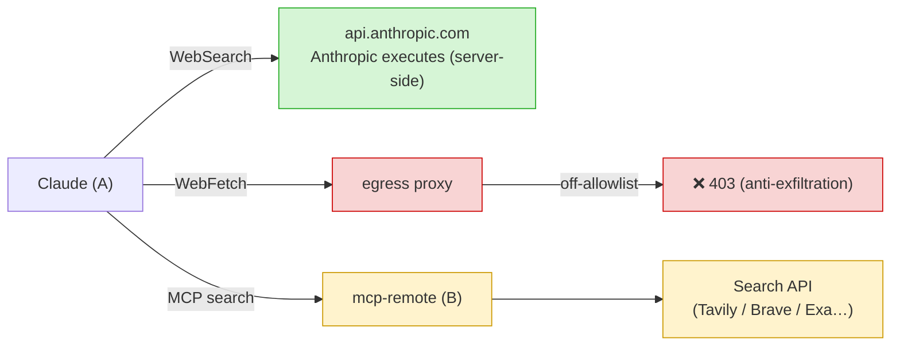

# Claude's Web Access

The only internet egress from container A goes through the **squid proxy** (container C),
under a **strict allowlist** (`profiles/<name>/allowlist.conf`, e.g. `profiles/claude/`).
Domains authorized by default (Claude Code v2, per official network docs):

| Domain | Purpose |
|---|---|
| `.anthropic.com` | API + Statsig telemetry |
| `.claude.ai` | subscription login + `downloads.claude.ai` (installer/updates) |
| `.claude.com` | `platform.claude.com` (Console auth) |
| `raw.githubusercontent.com` | release notes / skills marketplace |

Everything else is **denied (403)**. Telemetry and error reporting are disabled
(`DISABLE_TELEMETRY=1`, `DISABLE_ERROR_REPORTING=1`) to further reduce egress.

> Adding a domain: [`egress-allowlist.md`](egress-allowlist.md).

---

## Can Claude Search the Web?

Yes, but three distinct channels have very different behavior:

| Channel | Who makes the request | Status |
|---|---|---|
| `WebSearch` (built-in) | Anthropic servers (server-side) → `api.anthropic.com` | ✅ already works |
| `WebFetch` (built-in) | the CLI **in container A** → squid proxy | ⛔ blocked off-allowlist (*by design*) |
| MCP search | **container B** | ⚙️ to connect if needed |

- **`WebSearch`** is executed Anthropic-side: the search doesn't leave your machine, only
  the result comes back through the API. Works with no setup.
- **`WebFetch`** fetches a URL **from container A**, therefore through the proxy. A
  non-allowlisted domain is denied — this is **by design**: letting Claude fetch any URL
  would reopen an exfiltration channel.
- **MCP search**: for *controlled* web access, connect a search server in B (see
  [`add-mcp.md`](add-mcp.md)). The request leaves from B (which has internet), Claude
  only receives the result via the tunnel.

## ⚠️ The Tradeoff

Any web-egress tool (search or fetch) is *technically* an exfiltration channel: the agent
can encode data in a request. That's exactly what the allowlist aims to prevent. If you
open web access:

- prefer a **read-only MCP** filtered with `ALLOWED_TOOLS`;
- keep the egress allowlist as narrow as possible;
- only relax `WebFetch` towards trusted, documented domains.
